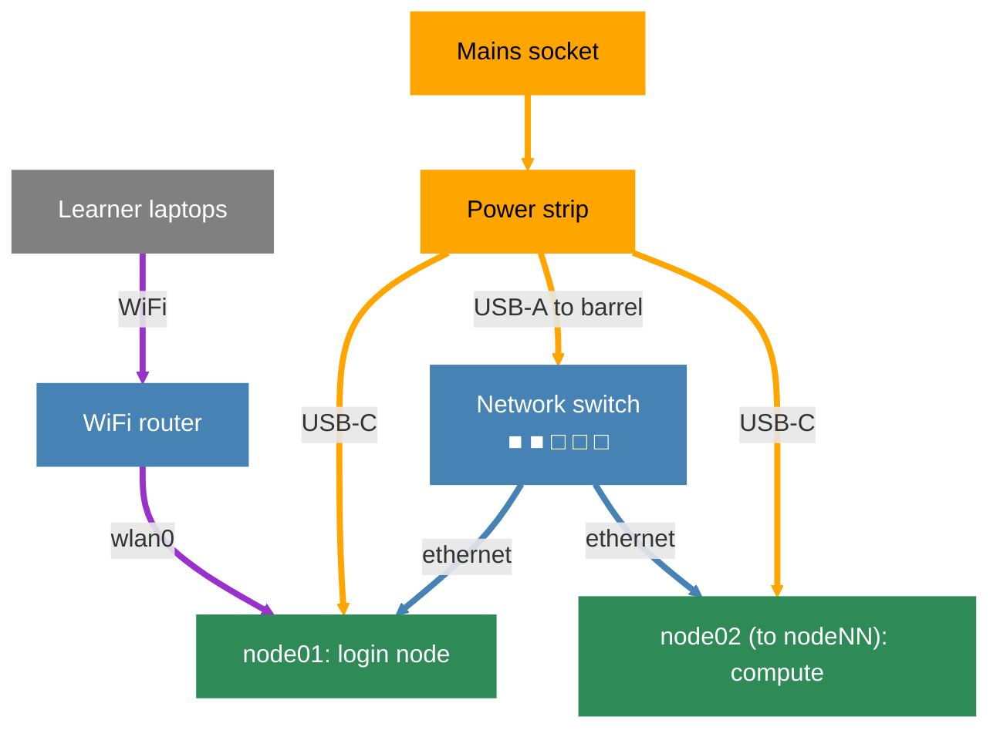
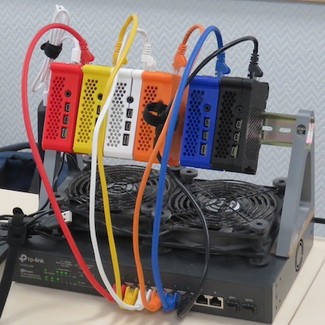

:::questions
- Why is training on a real HPC challenging for workshop instructors?
- What hardware is needed to build a mini-HPC for training?
:::

:::objectives
- Explain the challenges of using a real HPC for training purposes
- List the minimum hardware components needed for a Raspberry Pi mini-HPC
:::

:::instructor

The first thing to do is to get all learners to plug in the hardware
for their cluster. On its very first boot, the Pi automatically expands
the root filesystem to fill the SD card. This can take a minute or two,
during which the network interface will not yet be up.

This is a good time to deliver the lesson introduction. By
the time you have finished, the Pi will be ready to connect to.

:::

When running a workshop to teach learners how to use an HPC, an instructor is
immediately presented with a few problems:

1. Very few users ever get to see an HPC in real life and it is left to
imaginations and sci-fi movies to visualise what an HPC is. To many this is
quite a scary concept.
1. Training on a "real" HPC can cause learners to be anxious that they might
"break" something.
1. Access to an HPC needs to be arranged. This is not always a trivial task as
the use of HPC resources can be quite restricted in terms of who are allowed
to use a specific HPC.
1. Workshop attendees often do not read their emails
requesting them to create accounts before they turn up for the workshop which
results in instructors having to create accounts on the day. Apart from quite
often delaying the start of the workshop, it is also not always possible for
instructors to create the user accounts on the day.
1. HPC resources are always in demand and running a workshop on a "real" HPC
takes resources away from "real" processes running at the time.
1. HPCs typically have to be connected to via the Internet. Any issues with
accessing the Internet will affect the workshop.
1. If an HPC is heavily used or if someone runs a job on the login node,
learners might not be able to log in or there are significant delays in getting
jobs into queues which again affects the timing of the workshop.

All these mentioned issues (and probably more) can be addressed by having a
dedicated HPC for training. But usually "real" HPCs are very expensive and it
wouldn't be feasible to purchase typical high-end HPC hardware just for a
training setup. However, it is completely possible to use low-end hardware to
create a cluster that will run almost all the required software to learn how
to use an HPC.

## Minimal requirements

- Raspberry Pi (RPi) 3-5 2GB+ single board computers (SBC): 1 for the head node, plus as many nodes as as you want
- A multiport Netgear switch (as many ports as Rasberry Pis)
- 10BaseT Cat6 ethernet cables (1 per Rasberry Pi)
- Power supplies for each Rasberry Pi (alternatively: use a PoE switch to power all Rasberry Pis)
- A 8GB flash drive for shared storage
- A 32GB SD card to boot the main node from
- Cooling device (e.g. USB desktop fan)

## Hardware connections

The diagram below shows how the components connect. The login node has two
network interfaces: `eth0` connects to the internal switch, and `wlan0`
connects to the router so learners can reach the cluster over WiFi.

## Optional

- Example of casing:
  - 3D printed DIN Rail stand
  - 3D printed RPi cases

{alt='An example of a MiniHPC created with Raspberry Pis'}

*The first CarpentriesOffline MiniHPC, `pixie`, created with Raspberry Pis!*

:::keypoints
- A mini-HPC using Raspberry Pis solves common HPC training challenges: cost, restricted access, internet dependency, and resource contention
- The minimum hardware is one or more Raspberry Pi 4s (2GB+), a network switch, ethernet cables, SD cards, and a USB storage device
:::
