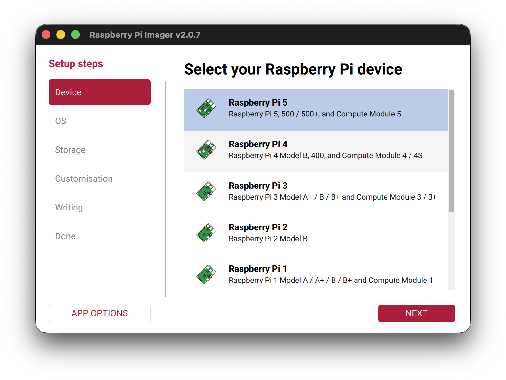
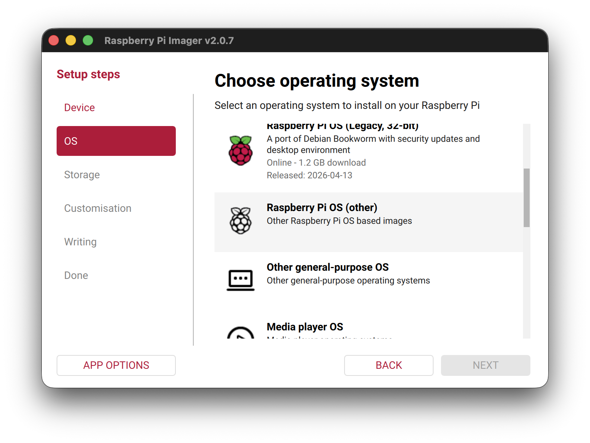
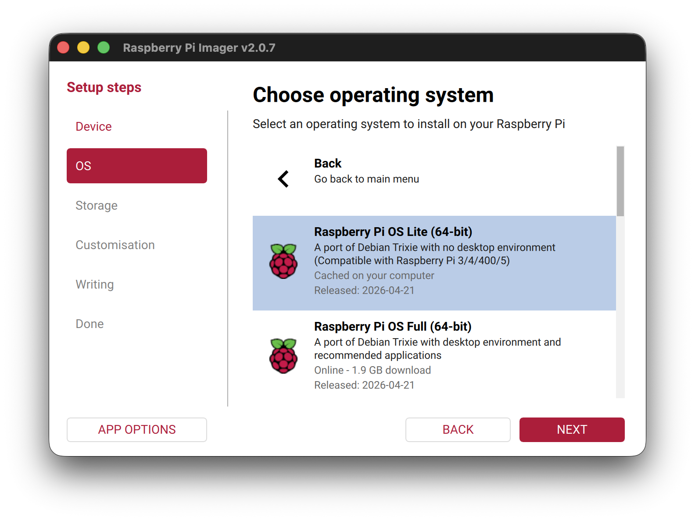
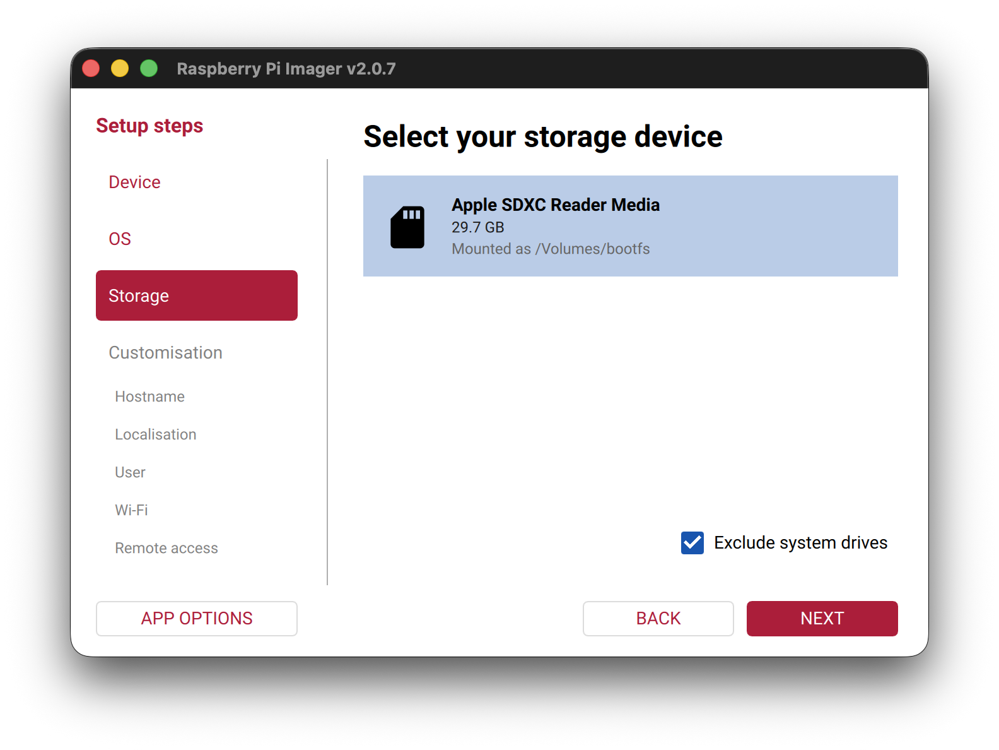
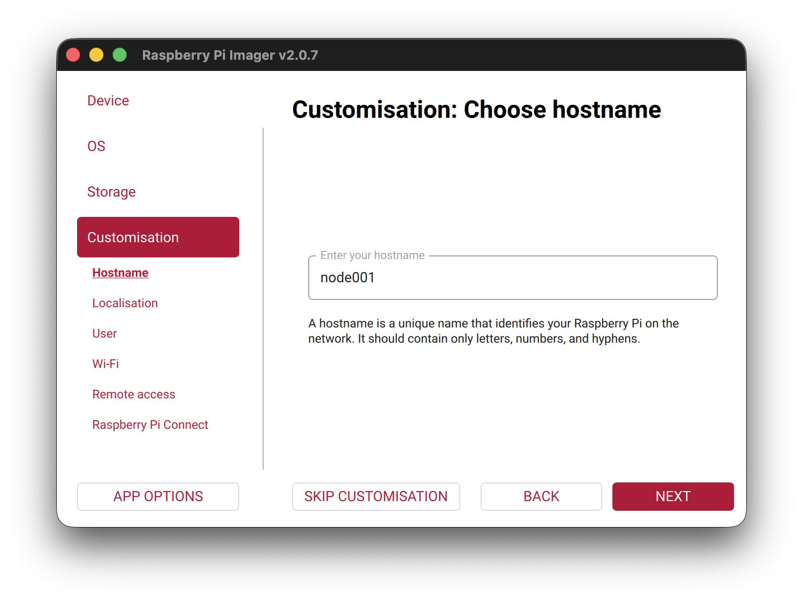
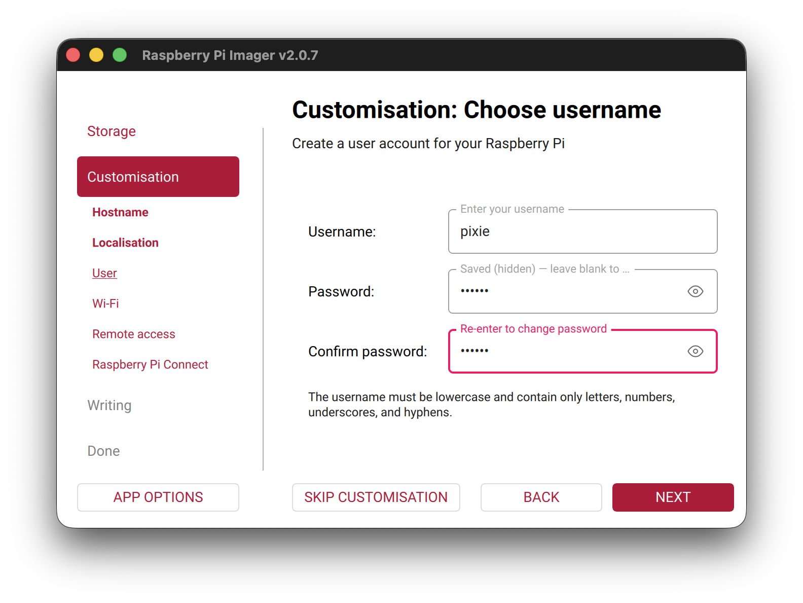
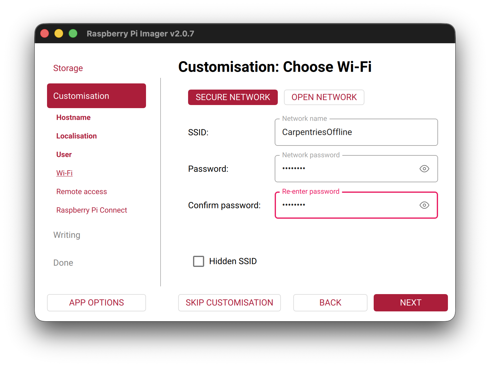
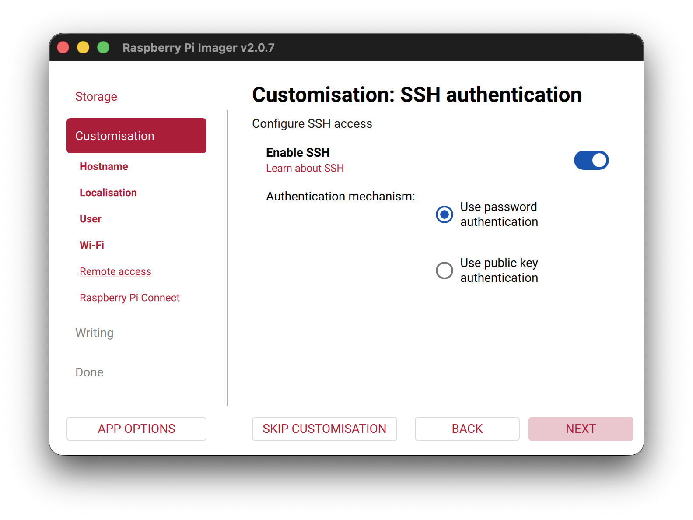
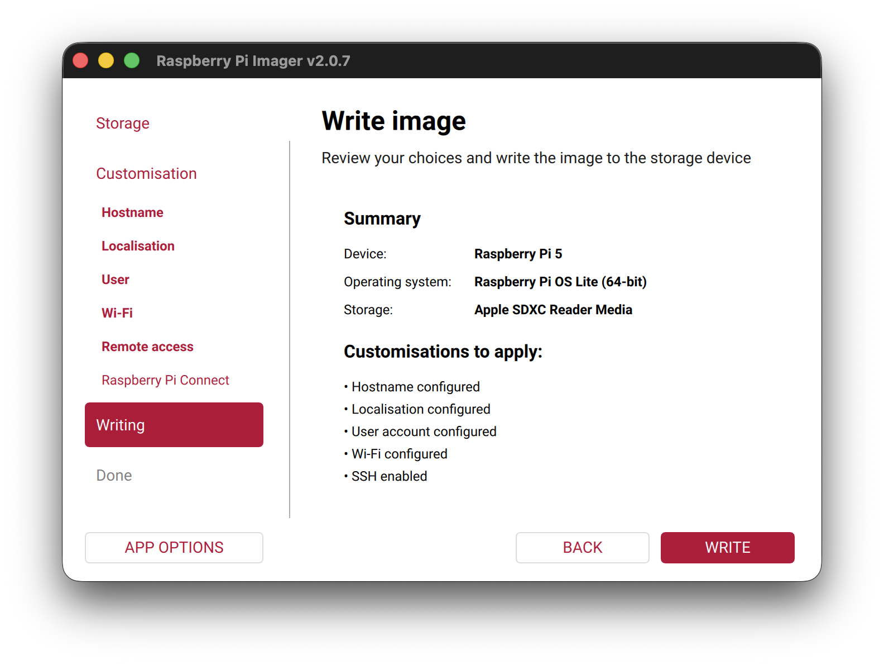

Every computer needs to load an operating system when you switch it on.
Therefore it will usually have a default place where it will look for an
operating system in the first place. The process of loading the operating system
is called **booting**. In general, if someone tells you to reboot your computer
it means to switch is off and switch it back on again so that the operating
system can be loaded from scratch. In the case of your desktop or laptop
computers you will have a hard drive built into the computer or alternatively
you might be able to boot from a USB device.

In the case of the Raspberry Pi its default booting device is an SD card.
Pre-RPi3 used a mini-SD card but RPi3 and RPi4 use micro-SD cards. SD cards are
available in various capacities, ie. the amount of information that can be
stored on it. A basic operating system for the Pi will probably take about 2GB
but then you will also need space for all the Carpentries lesson files and other
software that you want to make available to the learners.

Usually when you buy a RPi you can also buy an SD card with the operating system
pre-loaded. Alternatively you can buy an empty SD card and prepare it yourself.
Preparing the SD card involves downloading an **image** of the operating system
(and there are various versions available), downloading the software, Raspberry
Pi Imager, required for writing the image to the SD card and then using the
software to write the image to the SD card.

Internet connectivity might prove to be a problem during this workshop so your
instructor might bring an image along that can be copied or perhaps they will
provide pre-prepared microSD cards.

The Raspberry Pi can run several operating systems including several flavours
of Linux. The official Raspberry Pi OS is based on Debian Linux.

If you have not already done so you have to download and install the Raspberry
Pi Imager. Using your browser, navigate to the Raspberry Pi [download
page](https://www.raspberrypi.com/software/). You should now be able to select
the download for your operating system. Click on the appropriate link and save
the installation file to your computer. The web page will provide further
information for installing the software on your computer.
Once the installation is complete you should be able to run the Imager which
will open with the following screen:

## Creating an SD card image: step-by-step

### Setting up a Raspberry Pi

The official [Set up your SD card](https://projects.raspberrypi.org/en/projects/raspberry-pi-setting-up/2) is up to date as of 2nd of May 2024.

When using the The Raspberry Pi Imager, select the Device and OS.

The OS selection should be `Raspberry Pi OS (other)` -> `Raspberry Pi OS Lite (64-bit)`.

Selecting the device:

Selecting the OS is a two step process:

We want the OS with no desktop environment: use `Raspberry Pi OS Lite (64-bit)`:

After this, please select the sdcard you would like to flash the image on, then press `NEXT`.

The following configuration options can be defined for your set-up such that your OS is pre-configured upon first boot. This is useful as it means we can complete some of the initial configuration before flashing the image, without a screen and keyboard for the Pi.

At this point, we can enter the hostname:

> Hostname: `node01`

Repeating this for the second Pi, we will use a different hostname e.g. `node02`.

Check the label on your Pis for the hostname to use.

In the Localisation screen, select options for United Kingdom / London.

Next, set the username and password that will be used to log into the Pi using the `ssh` command.

1. Username: `pixie`
1. Password: `0nl1n3`

> *Pro-tip:* We've noticed occasional issues using the login name `pi` on fresh Rasbian Lite image – it takes you round in circles back to a login prompt! We'll use a different name to be sure here.

*Customisation: Choose Wi-Fi*: next, enter your WiFi details. For our workshop, we are using the network `CarpentriesOffline`.

Then on the "Remote Access" page, enable SSH with password authentication (alternatively, by adding a ssh public key).
You could also, if desired, [set up easy access to the Pi via an ssh key](ssh-setup.md).

After, saving this, select `NEXT` to apply the configuration. We can skip the final screen on setting up Raspberry Pi Connect.

Confirm writing to the sdcard (please backup any data on the sdcard, any existing data will be **LOST!**)

Once the image has been written to the SD card a **Write Successful** message
will be displayed. You can now remove the SD card from your computer and insert it into the
Raspberry Pi.
