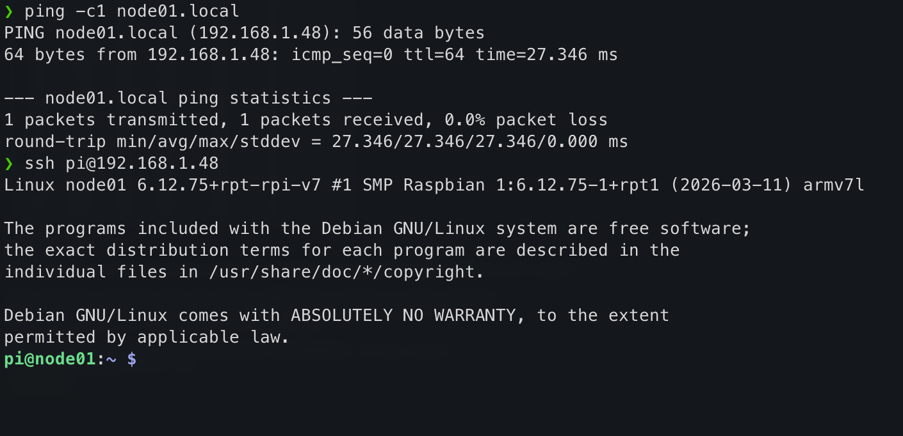

:::questions
- How do you connect to a freshly booted Raspberry Pi on the network?
- What are the first steps after logging in for the first time?
:::

:::objectives
- Find a Raspberry Pi on the network using `ping`
- Log in to the Pi via SSH
- Update and upgrade the OS packages
:::

## Running the OS for the first time

Once you have written the operating system to the microSD card you can insert
the card into the RPi and switch it on. If you configured the OS with a Wifi
SSID and enabled ssh you should be able to access the RPi via the wireless
network using your desktop or laptop computer.

::: callout First boot takes longer than usual

On its very first boot, the Pi automatically expands the root filesystem to
fill the SD card. This can take a minute or two, during which the network
interface will not yet be up. Wait until `ping node01.local` succeeds before
attempting to SSH in.

:::

### How do I find my IP address?

In the setup stage, you connected your Pi to the `CarpentriesOffline` WiFi
network and gave each node a name, for example `node01`. You can use the `ping`
command to check it is connected to the network:

```bash
❯ ping -c1 node01.local
PING node01.local (192.168.1.48): 56 data bytes
64 bytes from 192.168.1.48: icmp_seq=0 ttl=64 time=27.346 ms

--- node01.local ping statistics ---
3 packets transmitted, 3 packets received, 0.0% packet loss
round-trip min/avg/max/stddev = 8.019/9.380/11.158/1.315 ms
```

This performs a DNS lookup with the router and resolves the DNS address, 
`node01.local` to its dynamically-assigned IP address (here `192.168.1.48`),
then sends an ICMP "ping" packet to ensure we can reach it on the network.

### Logging in to the Pi

Use SSH or login with a local console (if you have a monitor attached). Use the
login details you used above to log into the Pi.

```bash
ssh <USERNAME>@<IP-ADDRESS>
```

In section 2, we set our username in the Raspberry Pi Imager to `pixie`, and
the password set there was `0nl1n3`.

Logging in should look something like this in your terminal:

{alt='Logged into node01 in the terminal'}

### Updating the software

Now you are connected, do an update and a full-upgrade:

```bash
sudo apt update
sudo apt full-upgrade -y
```

:::keypoints
- Use `ping node01.local` to confirm a Pi is reachable on the network before connecting
- SSH with `ssh <username>@<ip-address>` to log in
- Always update packages with `sudo apt update && sudo apt full-upgrade -y` before installing software
:::

