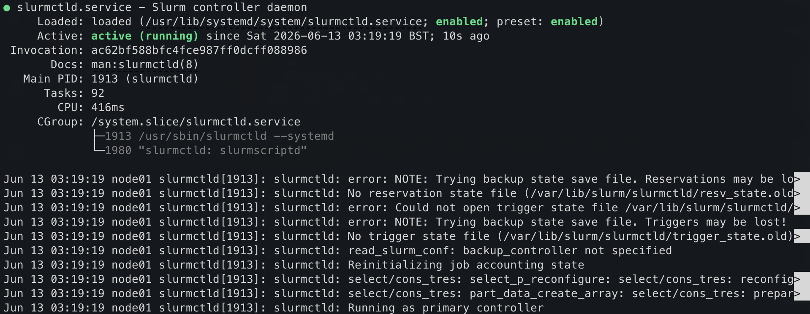

> **Configure the login node first.** The compute node configuration (next page) depends on files
> generated here (munge key, slurm.conf, /etc/hosts), and the login node must be up and running
> as the DHCP/DNS server before the compute node can reach the network.

## Start with an update

```bash
sudo apt update
sudo apt upgrade -y
```

## Install required packages

```bash
sudo apt-get install -y nfs-kernel-server lmod ansible slurm munge nmap \  
  nfs-common net-tools build-essential htop net-tools screen vim python3-pip \  
  dnsmasq slurm-wlm iptables iptables-persistent libmunge-dev libmunge2 \  
  libopenmpi-dev libopenmpi3t64 git xxd
```

A dialog block will appear on the screen. Answer yes to both questions.

> **Note:** On older Raspberry Pi OS releases, `libpmix2`, `libpmix-bin`, and `libpmix-dev` were
> separate packages. These were merged into OpenMPI in Debian Bookworm — use `libopenmpi3t64`
> and `libopenmpi-dev` instead.

| Package.                           | Purpose                                                                    |
| ---------------------------------- | -------------------------------------------------------------------------- |
| `nfs-kernel-server`                | NFS server — exports the shared filesystem to compute nodes                |
| `nfs-common`                       | NFS client utilities, also needed on the login node                        |
| `lmod`                             | Lua-based module system for managing software environments (e.g. ESSI)     |
| `ansible`                          | Automation tool for configuring compute nodes in bulk                      |
| `slurm-wlm`                        | Slurm workload manager — schedules and dispatches jobs across the cluster  |
| `munge`                            | Authentication service used by Slurm daemons to verify messages            |
| `libmunge2`, `libmunge-dev`        | MUNGE shared library and development headers                               |
| `libopenmpi3t64`, `libopenmpi-dev` | OpenMPI runtime and headers — provides PMIx support for Slurm job launch (PMIx packages were merged into OpenMPI in Debian Bookworm) |
| `dnsmasq`                          | Lightweight DHCP and DNS server — assigns IPs to compute nodes             |
| `iptables`, `iptables-persistent`  | Firewall and NAT rules; persistent saves them across reboots               |
| `nmap`                             | Network scanner — useful for verifying compute nodes are reachable         |
| `net-tools`                        | Legacy networking tools (`ifconfig`, `netstat`, etc.)                      |
| `build-essential`                  | Compilers and build tools (`gcc`, `make`, etc.)                            |
| `htop`                             | Interactive process viewer                                                 |
| `screen`                           | Terminal multiplexer — keeps sessions alive over SSH                       |
| `vim`                              | Text editor                                                                |
| `python3-pip`                      | Python package installer                                                   |
| `git`                              | Version control                                                            |
| `xxd`                              | Hex dump tool — used to safely pipe binary data (e.g. munge key) via `tee` without corrupting the terminal |

Now, we can remove any redundant packages left over after our upgrades and package installations:

```bash
sudo apt-get -y autoremove
```

> **Note:** This stage can take quite a long time on older hardware (Pi 2Bs or Pi 3s, for instance).
> The hardware in the workshop uses Raspberry Pi 5s, so shouldn't keep you waiting too long.

## Enable IP forwarding

Create a drop-in configuration file so the system setting is not mixed with distribution defaults:

```bash
echo "net.ipv4.ip_forward=1" | sudo tee /etc/sysctl.d/99-ip-forward.conf
sudo sysctl --system
```

`sudo sysctl --system` applies all drop-in files immediately, so a reboot is not required.

## Configure IP-tables

```bash
sudo iptables -t nat -A POSTROUTING -o eth0 -j MASQUERADE
sudo iptables -A FORWARD -i wlan0 -o eth0 -j ACCEPT
sudo iptables -A FORWARD -i eth0 -o wlan0 -m state --state RELATED,ESTABLISHED -j ACCEPT
sudo netfilter-persistent save
```

## Configure the network interfaces

> **Warning:** Do **not** edit `/etc/network/interfaces` on current Raspberry Pi OS (Bookworm).
> That file is not used when NetworkManager is active, and mixing the two causes unpredictable
> behaviour. Use `nmcli` instead.

The login node needs a **fixed IP** on its ethernet interface (`eth0`) so the compute nodes
always reach it at the same address, and so dnsmasq can hand out leases reliably.
Ethernet interfaces must be set to "unmanaged" in the sense that they carry a static address
rather than requesting one via DHCP — NetworkManager still controls the interface, but DHCP
is disabled for it.

```bash
sudo nmcli con add type ethernet ifname eth0 con-name eth0-static \
  ipv4.method manual \
  ipv4.addresses 192.168.5.101/24 \
  ipv4.gateway 192.168.5.101 \
  ipv4.dns 192.168.5.101 \
  connection.autoconnect yes
sudo nmcli con up eth0-static
```

> **Note:** Need to reverse this for any reason?  
> `sudo nmcli con delete eth0-static` is your friend.  
> You may also wish to keep only the wifi as the outgoing route to contact the internet:  
> `sudo ip route del default via 192.168.5.101 dev eth0` will do that, if required.

Verify the address is set:

```bash
ip addr show
```

You should see a static address of `192.168.5.101` assigned to `eth0`. Your SSH connection to the Pi is running through `wlan0` at this point:


## How to modify the hostname (*if required!*)

If you followed section 2 correctly, your hostname will already be set. However, if you need to modify it for any reason, you can do so with the following command:

```bash
echo pixie01 | sudo tee /etc/hostname
```

> **Warning:** This hostname **must** match the value used in the config files below,
> particularly `/etc/hosts` and `/etc/slurm/slurm.conf`. Take extra care when editing these
> files that they match the values for your login and compute node hostnames.

## Configure DHCP

Configure dhcp by entering the following in the file `/etc/dhcpd.conf`

```bash
interface eth0
static ip_address=192.168.5.101/24
static routers=192.168.5.101
static domain_name_servers=192.168.5.101
```

> _Pro-tip:_ You can populate the files in this section however you'd like. However,
> one of the easier ways is dropping to a root shell, and using `cat` with a
> redirection operator `>`, e.g.:
>
> ```bash
>   pi@node01:~ $ sudo su
>   root@node01:/home/pi# cat > /etc/dhcpd.conf
>   <paste your lines here, then hit Ctrl+C>
>   ^C
>   root@node01:/home/pi# 
> ```

## Configure DNS masquerading

First, retrieve the ethernet MAC address of your compute node. If it is already on the
network over WiFi, you can do this from the login node, or from your laptop:

```bash
ssh node02.local "ip link show eth0"
```

Look for the `link/ether` line — the MAC address is the six colon-separated hex pairs,
e.g. `b8:27:eb:6e:7d:6d`.

Now configure dnsmasq by entering the following in `/etc/dnsmasq.conf`, substituting
your compute node's MAC address into the `dhcp-host` line:

```bash
interface=eth0
bind-dynamic
domain-needed
bogus-priv
dhcp-range=192.168.5.102,192.168.5.200,255.255.255.0,12h
dhcp-host=b8:27:eb:6e:7d:6d,192.168.5.102
dhcp-option=3,192.168.5.101 # default route — the login node
```

Restart dnsmasq to apply the config:

```bash
sudo systemctl restart dnsmasq
```

Verify it is now listening on the DHCP port:

```bash
sudo ss -ulnp | grep :67
```

You should see `dnsmasq` bound to port 67.

## Create a shared directory

```bash
sudo mkdir /sharedfs
sudo chown nobody:nogroup -R /sharedfs
sudo chmod 777 -R /sharedfs
```

## Configure NFS

Configure shared drives by adding the following at the end of the file `/etc/exports`

```bash
/sharedfs    192.168.5.0/24(rw,sync,no_root_squash,no_subtree_check)
```

## Configure hosts

- The `/etc/hosts` file should contain the following. Make sure to change all occurences of `pixie` in this block to the name of your cluster:

```bash
127.0.0.1 localhost
::1       localhost ip6-localhost ip6-loopback
ff02::1   ip6-allnodes
ff02::2   ip6-allrouters

# This login node's hostname
127.0.1.1 pixie01
192.168.5.101 pixie01

# IP and hostname of compute nodes
192.168.5.102 pixie02
```

> **Warning:** Don't copy-and-paste this block without altering it to match your hostname!

## Configure Slurm

Add the following to `/etc/slurm/slurm.conf`. **Change all occurences of `pixie` in this script to the name of your cluster.**

```conf
SlurmctldHost=pixie01(192.168.5.101)
MpiDefault=none
ProctrackType=proctrack/cgroup
#ProctrackType=proctrack/linuxproc
ReturnToService=1
SlurmctldPidFile=/run/slurmctld.pid
SlurmctldPort=6817
SlurmdPidFile=/run/slurmd.pid
SlurmdPort=6818
SlurmdSpoolDir=/var/lib/slurm/slurmd
SlurmUser=slurm
StateSaveLocation=/var/lib/slurm/slurmctld
SwitchType=switch/none
TaskPlugin=task/affinity
InactiveLimit=0
KillWait=30
MinJobAge=300
SlurmctldTimeout=120
SlurmdTimeout=300
Waittime=0
SchedulerType=sched/backfill
SelectType=select/cons_tres
SelectTypeParameters=CR_Core
AccountingStorageType=accounting_storage/none
# AccountingStoreJobComment=YES
AccountingStoreFlags=job_comment
ClusterName=pixie
JobCompType=jobcomp/none
JobAcctGatherFrequency=30
JobAcctGatherType=jobacct_gather/none
SlurmctldDebug=info
SlurmctldLogFile=/var/log/slurm/slurmctld.log
SlurmdDebug=info
SlurmdLogFile=/var/log/slurm/slurmd.log
PartitionName=pixiecluster Nodes=pixie[02-02] Default=YES MaxTime=INFINITE State=UP
RebootProgram=/etc/slurm/slurmreboot.sh
NodeName=pixie01 NodeAddr=192.168.5.101 CPUs=4 State=IDLE
NodeName=pixie02 NodeAddr=192.168.5.102 CPUs=4 State=IDLE
```

> **Warning:** Don't copy-and-paste this block without altering it to match your hostname!

Next, restart slurm:

```bash
sudo systemctl restart munge
sudo systemctl restart slurmctld
sudo systemctl restart slurmd
```

> **Note:** `slurmd` must be restarted after the config is in place — it is installed earlier
> but will be in a failed state until now. Munge must be started first as both daemons depend on it.

At this point, you should see Slurm running if you check using `sudo systemctl status slurmctld`:



## Configure munge

Munge is the authentication service we'll be using in our Pi HPC cluster. We need to do some configuration here first.

Create the munge key using the `mungekey` tool, which handles size and permissions correctly:

```bash
sudo mungekey --create
```

Verify ownership and permissions:

```bash
sudo ls -la /etc/munge/munge.key
```

## Install EESSI

```bash
mkdir eessi
cd eessi
wget https://raw.githubusercontent.com/EESSI/eessi-demo/main/scripts/install_cvmfs_eessi.sh
sudo bash ./install_cvmfs_eessi.sh

source /cvmfs/software.eessi.io/versions/2023.06/init/lmod/bash
# We don't do this one anymore:
# echo "source /cvmfs/software.eessi.io/versions/2023.06/init/bash" | sudo tee -a /etc/profile
```

> **Note:** Only Pi 3 and later are supported by EESSI, as it needs a 64-bit OS.

## Optional: Disable WiFi and Bluetooth

Now that we have set our login node up as a DHCP server, we can disable WiFi if desired.

Open `/boot/firmware/config.txt` and add the following two lines at the bottom in the `[all]` section.

```ini
dtoverlay=disable-wifi
dtoverlay=disable-bt
```

Save the file and reboot. From now on, you'll use the Ethernet IP `192.168.5.1` to connect to the login node.
